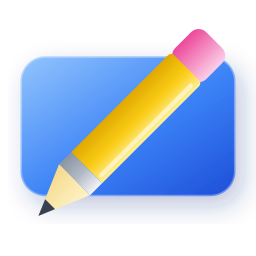

<div align="center">



# Ink Canvas Ultra
[](https://github.com/WXRIW/Ink-Canvas)
[](./LICENSE)
[](https://github.com/muqiu-pika/Ink-Canvas-Ultra/releases/latest)

</div>

## 👋 欢迎使用 Ink Canvas Ultra

Ink Canvas Ultra 是一款轻量级、高性能的电子白板软件，专为教学和演示场景优化，基于 GPLv3 许可证发布。

## 🌟 项目简介

Ink Canvas Ultra 画板是一款针对希沃白板设备进行了特别优化的轻量级画板软件，与预装的"希沃白板 5"软件相比，启动速度大幅度提升（提升5-10倍），系统资源占用更小，使用体验更佳。

## 🚀 主要功能

### 三种工作模式
- **幻灯片模式**: 在PowerPoint放映时提供批注工具
- **画板模式**: 类似希沃白板的黑板/白板功能
- **屏幕画笔模式**: 在任意屏幕内容上进行标注

### 智能交互体验
- 支持压感笔，笔的细头书写，粗头可作橡皮擦
- 手掌/手背可作为区域橡皮擦
- 双指缩放、旋转、拖动墨迹
- 自动识别图形并转换为规范图形

### 丰富的绘图工具
- 各种预设图形：直线、虚线、圆、椭圆、双曲线、抛物线等
- 坐标系工具：平面直角坐标系、空间直角坐标系
- 几何图形：长方体、圆锥、圆柱
- 平行线绘制（适合电场线等教学场景）

## 📖 文档网站

本网站使用 [vuepress](https://vuepress.vuejs.org/) 和 [vuepress-theme-plume](https://github.com/pengzhanbo/vuepress-theme-plume) 构建，提供完整的 Ink Canvas Ultra 使用文档。

### 安装依赖

```sh
npm i
```

### 使用说明

```sh
# 启动开发服务器
npm run docs:dev
# 构建生产版本
npm run docs:build
# 预览生产构建
npm run docs:preview
# 更新 vuepress 和主题
npm run vp-update
```

## 📚 文档目录

- [快速入门](/guide/getting-started.md) - 快速上手使用
- [功能概览](/guide/features.md) - 详细功能介绍
- [高级功能与技巧](/guide/advanced-features.md) - 高级功能和使用技巧
- [设置说明](/guide/settings.md) - 配置选项详解
- [快捷键](/guide/hotkeys.md) - 快捷键参考
- [安装与更新](/guide/install-and-update.md) - 安装和更新指南
- [集成指南](/guide/integration.md) - 与其他软件集成
- [故障排除](/guide/troubleshooting.md) - 常见问题解决

## 🤝 贡献

欢迎提交 Issue 和 Pull Request 来改进文档内容。

## 📄 许可证

本项目采用 GPLv3 许可证，详见 [LICENSE](./LICENSE) 文件。
